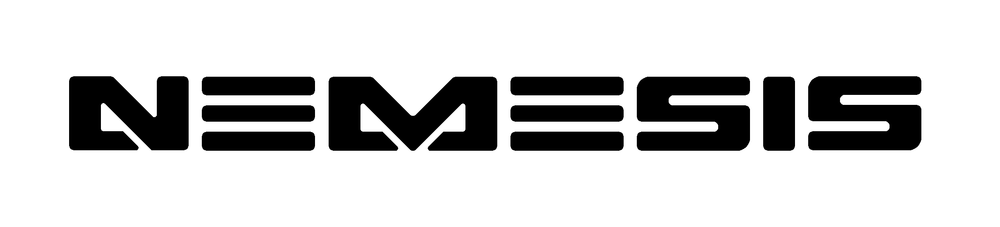

 

  
  <h3 align="center">Epimetheus</h3>
  

    Add-on board to enable compatibility between HD addons and modchips for the original Xbox by NeMesiS
     
     
    <a href="https://github.com/OfficialTeamUIX/Epimetheus"><strong>Explore the repo »</strong></a>
     
     
  

## About The Project
This project was built out of necesity. Simply put it is an STM addon board for Xbox "HDMI" addons that can be built rather than using a developer/debug board to match your current hardware install. As-is, it is non functional until paired with an existing pineapple flavored product, and license.
